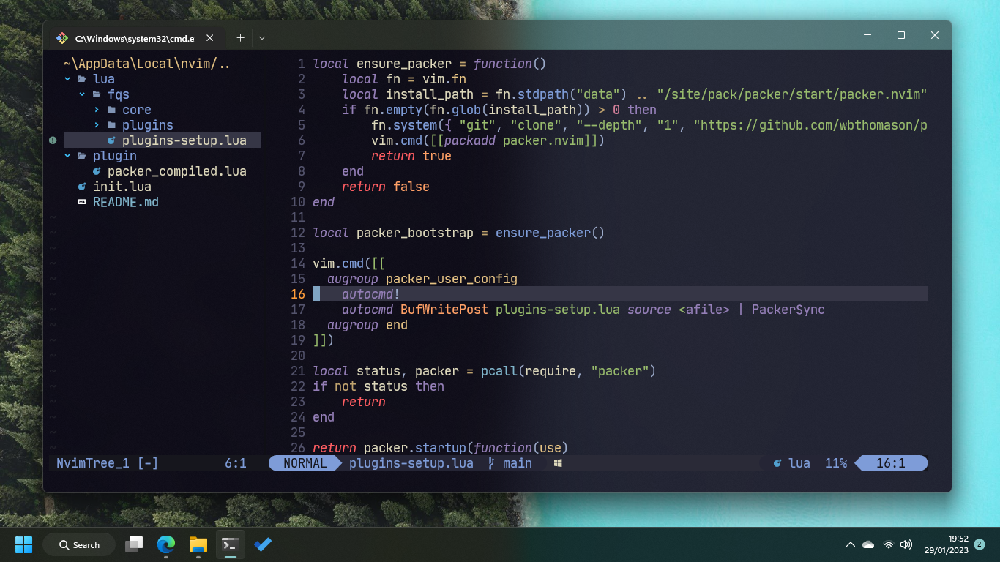
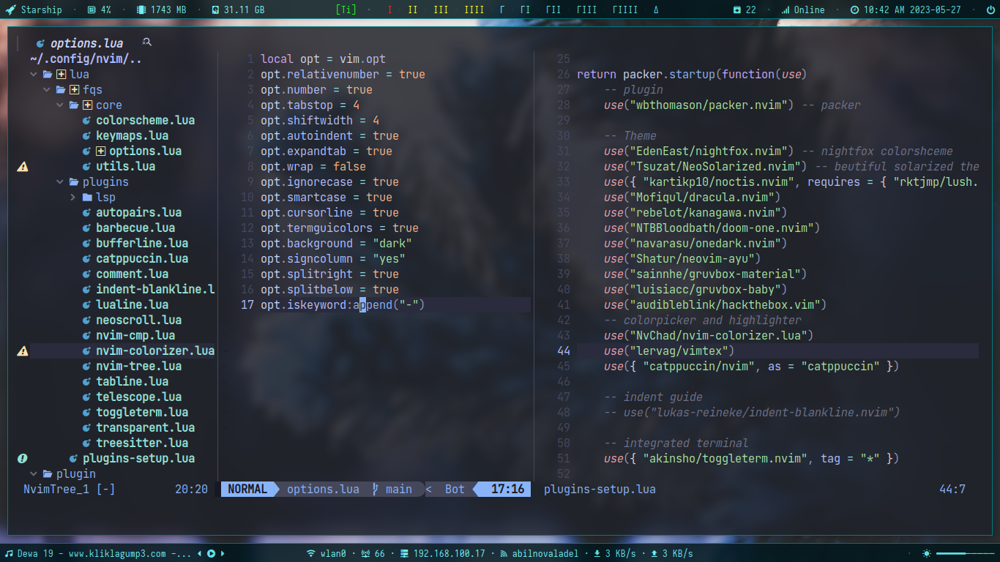

# MY NEOVIM DOTFILES

Want to use it?, just copy to the ~/.config/nvim/ (for linux) or ~/AppData/Local/nvim/ (for windows). All plugin and whatever will automatically installed.
- for fonts I use nerd font: [caskaydia cove](https://www.nerdfonts.com/font-downloads). You can download any other patched font here https://www.nerdfonts.com/font-downloads
- Use windows terminal for blur/acrylic/mica
- Windows terminal theme can be downloaded [here](https://windowsterminalthemes.dev/). COpy to your JSON file
- I use powershell 7.0. See [here](https://learn.microsoft.com/en-us/powershell/scripting/install/installing-powershell-on-windows?view=powershell-7.3) for the installation guide. Or you might use [git bash](https://git-scm.com/downloads) on windows.
- In addition, i use [oh my posh](https://ohmyposh.dev/docs/themes) to beautify whatever my "[shell](https://www.geeksforgeeks.org/difference-between-terminal-console-shell-and-command-line/)" is on windows
